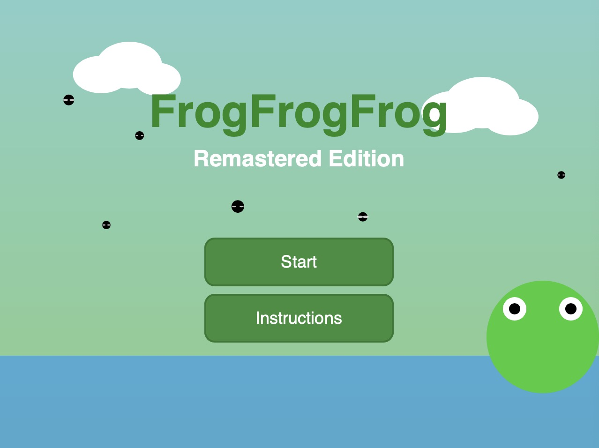

# FrogFrogFrog Remastered Edition

Haolei Ma

[View this project online](https://mmmcarter.github.io/CART253-Fall-2025-/topics/mod-jam/)

## Description

> FrogFrogFrog Remastered Edition (Mod-Jam Assignment for CART-253) is an enhanced version of a game based on the simple frogfrogfrog game template. The game  now includes essential core elements such as: a formal title screen, buttons to enter the game or the insctruction page, a comprehensive scoring system, reward and penalty mechanics, victory conditions, sound effects, etc.

### Controls

> Mouse moving and pressing

## Screenshot(s)

> 
> 

## Attribution

> JavaScript libraries:
  - [p5.js](https;//p5js.org)
> Other Attributions:
  - FrogFrogFrog-Main by Pippin Barr.
  - Function Challenge exercise in class.
  - Conditional Challenge exercise in class.
  - Variables Challenge exercise in class.
  - Events Challenge esercise in class.

## License

> This project is licensed under a Creative Commons Attribution ([CC BY 4.0](https://creativecommons.org/licenses/by/4.0/deed.en)) license with the exception of libraries and other components with their own licenses.