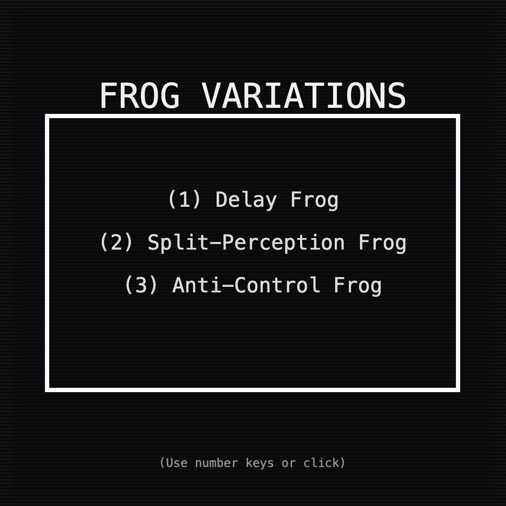
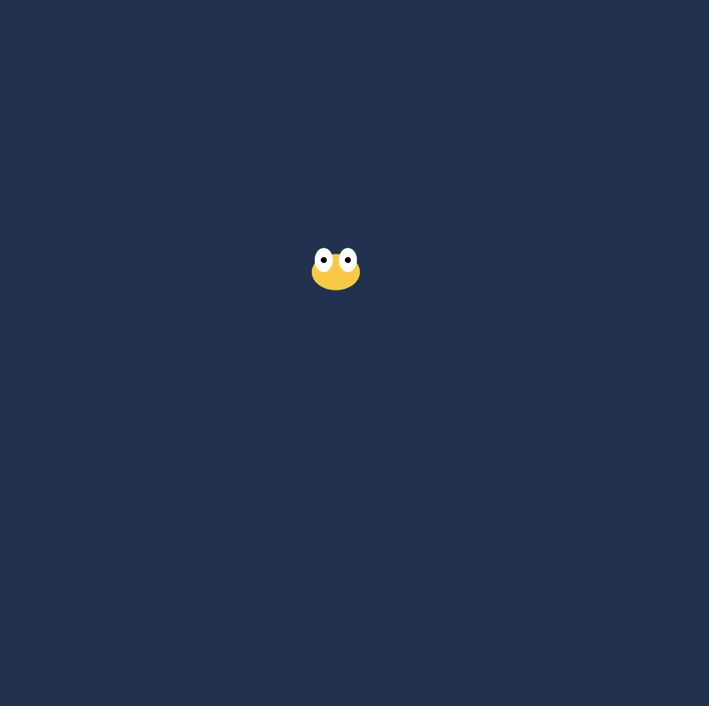
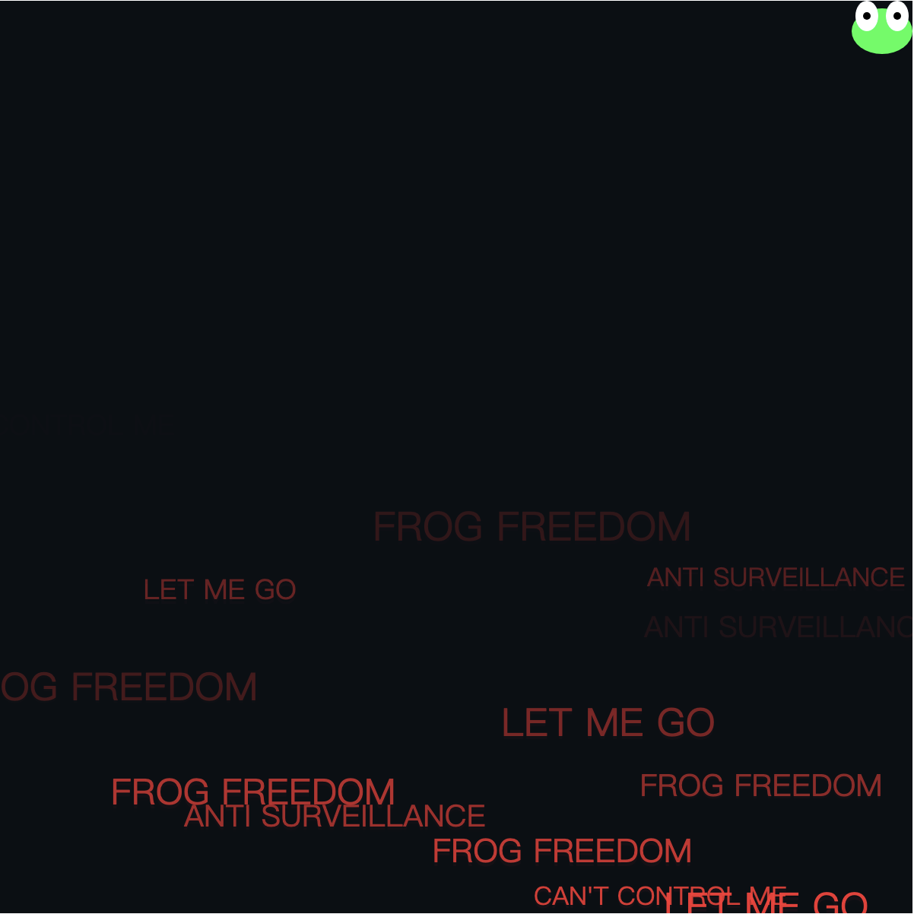

# Frog Variations

Haolei Ma

[View this project online](https://mmmcarter.github.io/CART253-Fall-2025-/topics/variation-jam/)

## Description

> Frog Variations is a creative interactive project exploring three experimental "frog" variations. Each variation demonstrates unique visual and interactive behaviors, inspired by perception, delay, and anti-control dynamics. 

> The project contains three interactive frog experiments:

1. Delay Frog
- Core Significance: Exploring How Delays in Human-Computer Interaction (HCI) affect Users' Sense of Control.
- The real frog immediately follows the mouse.
- A delayed frog slowly chases the real frog.
- The delayed frog leaves a smooth trail behind it, showing motion history.

2. Split-Perception Frog
- Core Significance: Unconventional HCI experiments: Let control no longer be uniform, but rather a collage of inputs from multiple senses.
- Horizontal movement follows the mouse.
- Vertical movement responds to microphone input (audio level).
- Multi-layer afterimages and audio-reactive eye movement visualize sound and perception.
- Keyboard typing affects frog color based on typing rhythm.

3. Anti-Control Frog
- Core Significance: Exploring the possibility of overturning the assumption that “users hold absolute dominance” in AI interfaces, enabling systems to become “semi-autonomous entities".
- Frog actively resists mouse control: it moves away from the cursor.
- Generates floating protest text (e.g., “RESIST”, “NO TRACKING”) for a political/experimental aesthetic.
- Screen shakes slightly when the mouse is too close, enhancing the sense of resistance.

> How to Use
Menu Navigation:
Hover over options and click, or press 1, 2, or 3 to select a variation.
Press ESC at any time to return to the menu.
Variation Controls:
Delay Frog: Move the mouse to see the real and delayed frogs.
Split-Perception Frog: Move the mouse horizontally, speak or make noise for vertical movement, type keys to affect frog color.
Anti-Control Frog: Move the mouse near the frog to see it evade, watch floating protest text, enjoy the subtle screen shake.

## Screenshot(s)

> 
> 
> 
> 

## Attribution

> JavaScript libraries:
  - [p5.js](https;//p5js.org)
> Other Attributions:
  - FrogFrogFrog-Main by Pippin Barr.
  - Variation-menu template by pippin Barr
  - Arrays Challenge exercise in class.
  - Conditional Challenge exercise in class.
  - Variables Challenge exercise in class.
  - Events Challenge exercise in class.
  - Function Challenge exercise in class.

## License

> This project is licensed under a Creative Commons Attribution ([CC BY 4.0](https://creativecommons.org/licenses/by/4.0/deed.en)) license with the exception of libraries and other components with their own licenses.